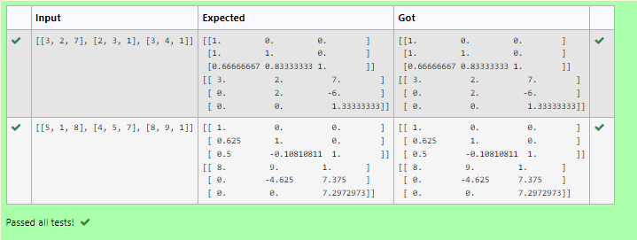
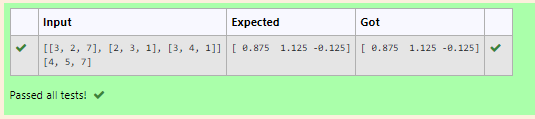

# LU Decomposition without zero on the diagonal

## AIM:
To write a program to find the L and U matrix using LU Decomposition.

## Equipments Required:
1. Hardware – PCs
2. Anaconda – Python 3.7 Installation / Moodle-Code Runner

## Algorithm
1. Start program
2. import numpy and lu module for mathematical operation
3. do the mathematical operations using the modules
4. print the result using print() function
5. End the program

## Program:
```
'''Program to find L and U matrix using LU decomposition.
Developed by: Karthikeyan.K
RegisterNumber: 21001828
'''
# To print L and U matrix
import numpy as np
from scipy.linalg import lu
A=np.array(eval(input()))
P,L,U = lu(A)
print(L)
print(U)

```

## Output:



## Result:
Thus the program to find the L and U matrix using LU Decomposition is written and verified using python programming.


# LU Decomposition without zero on the diagonal

## AIM:
To write a program to find value using LU Decomposition.

## Equipments Required:
1. Hardware – PCs
2. Anaconda – Python 3.7 Installation / Moodle-Code Runner

## Algorithm
1. Start program
2. import numpy and lu module for mathematical operation
3. do the mathematical operations using the modules
4. print the result using print() function
5. End the program

## Program:
```
'''Program to find a value using LU decomposition.
Developed by: Karthikeyan.K
RegisterNumber: 21001828
'''

# To print L and U matrix
import numpy as np
from scipy.linalg import lu_factor,lu_solve
A=np.array(eval(input()))
B=np.array(eval(input()))
lu,pivot = lu_factor(A)
x = lu_solve((lu,pivot),B)
print(x)
```

## Output:



## Result:
Thus the program to solve the matrix to find value using LU Decomposition is written and verified using python programming.
